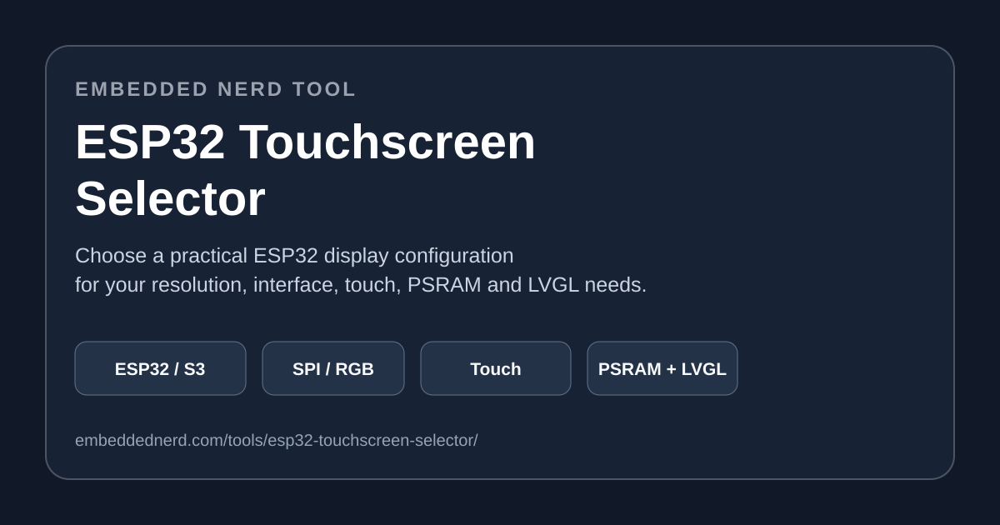

# ESP32 Touchscreen Selector

A lightweight, dependency-free web tool for choosing an ESP32 touchscreen configuration based on display, touch, memory and GUI requirements.

🚀 **[Try the live ESP32 Touchscreen Selector](https://embeddednerd.com/tools/esp32-touchscreen-selector/)**



## Why this tool exists

Choosing an ESP32 touchscreen is more than choosing a screen size. The ESP32 variant, resolution, display interface, touch controller, touch interface, PSRAM and GUI requirements can all affect the practical hardware choice.

The selector turns those requirements into a practical starting configuration and highlights areas that should be verified before buying hardware.

## What it considers

- ESP32, ESP32-S2, ESP32-S3 and ESP32-C3
- Display size and resolution
- SPI, RGB and 8080 / Parallel display interfaces
- Capacitive and resistive touch
- I²C and SPI touch interfaces
- PSRAM requirements
- LVGL requirements
- Project type and graphical complexity

## What you get

- Recommended ESP32 variant
- Recommended display characteristics
- Touch technology and interface guidance
- PSRAM guidance
- LVGL suitability
- Estimated project difficulty
- Compatibility warnings
- Matching hardware suggestions

The result is guidance rather than a hardware-compatibility guarantee. Always verify the exact module documentation before purchasing.

## Recommendation approach

The selector evaluates the combination of requirements instead of relying on a single field. In particular, it considers memory demand, display bandwidth, GPIO requirements and graphical complexity.

Examples include:

- Higher-resolution RGB projects tend to point toward ESP32-S3 configurations.
- Larger displays and LVGL projects can increase the need for PSRAM.
- ESP32-C3 selections are flagged for additional verification with demanding RGB or high-resolution configurations.
- Existing user selections are respected, with conflicts reported rather than silently replaced.
- Unknown selections produce practical guidance together with verification warnings.

## Run locally

No build system or external dependencies are required.

```bash
git clone https://github.com/webzf/esp32-touchscreen-selector.git
cd esp32-touchscreen-selector
```

Open `index.html` in a browser, or serve the directory with any static web server.

## Repository structure

```text
essp32-touchscreen-selector/
├── index.html
├── css/
│   └── selector.css
├── js/
│   └── selector.js
├── assets/
│   └── esp32-touchscreen-selector-promo.svg
├── .github/
│   └── ISSUE_TEMPLATE/
│       ├── bug_report.md
│       └── feature_request.md
├── LICENSE
└── README.md
```

## Canonical live version

The hosted Embedded Nerd version is the canonical user-facing tool:

**[embeddednerd.com/tools/esp32-touchscreen-selector/](https://embeddednerd.com/tools/esp32-touchscreen-selector/)**

This repository is intended for source inspection, local testing, issue reports, feature requests and contributions.

## Related Embedded Nerd guide

**[ESP32 Touchscreen Displays: Complete Guide](https://embeddednerd.com/esp32-touchscreen-displays-guide/)**

Use the guide for deeper information about display interfaces, touchscreen technologies, ESP32-S3, PSRAM, LVGL and choosing touchscreen hardware.

## Contributing

Issues and pull requests are welcome. Useful contributions include:

- Additional ESP32 boards
- Additional touchscreen displays
- Touch-controller compatibility rules
- Better recommendation rules
- Bug fixes
- Accessibility and usability improvements
- Documentation improvements

When reporting a compatibility problem, include the selected board, display size, resolution, interface, touch technology, touch interface, LVGL and PSRAM settings where possible.

## Important compatibility note

Before ordering hardware, verify:

- Display controller
- Touch controller
- GPIO and pinout
- Logic voltage and power requirements
- Available RAM and PSRAM
- Display interface
- Touch interface
- Arduino / ESP-IDF / LVGL driver support

Different modules using the same display size or controller can have different wiring and software requirements.

## License

MIT License. See [LICENSE](LICENSE).

## Topics

`esp32` `esp32-s3` `esp32-display` `esp32-touchscreen` `touchscreen` `lvgl` `iot` `embedded-systems` `electronics` `arduino` `maker` `embedded` `tft-display`
